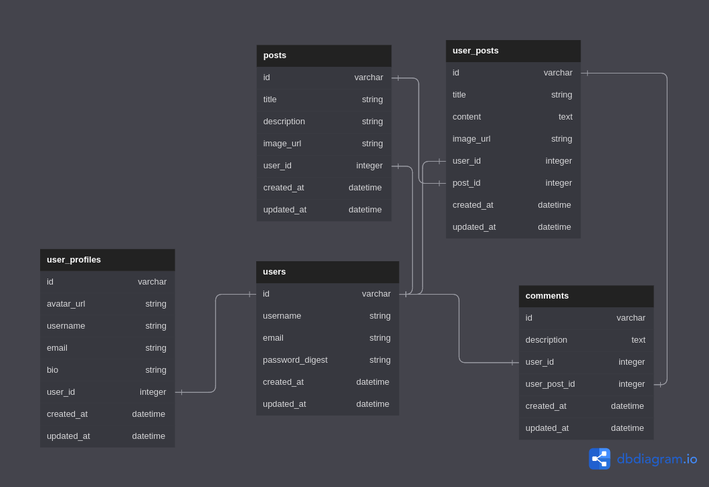

# README

# BLOGIFY Blog post api
This api has been used to build a single page application that allows with a creative acumen
to put down their imaginations into prolific words and post their reflections and ideas for everyone to see.

## Entity Relationship Diagram(ERD)
The ERD has been attached below to show and demonstrate the relationships between the different model entities.

## Pre-Requisites
In order to use this repository you will need the following:

- Operating System **(Windows `10+`, Linux `3.8+`, or MacOS X `10.7+`)**
- RAM >= 4GB
- Free Space >= 2GB

## Built With
This application has been built with the following tools:

- **Ruby `v2.7.4`**
- **Rails `v7.0.4`**
- **SQlite3 `v1.4`**
- **ActiveRecord `v7.0.4`**
- **Puma `v6.1`**
- **Faker `v0.14`**
- **Bcrypt `v3.1.7`**

## Topics Covered
The following are the concepts covered in this practice session

- Active Record Migrations.
- Active Record Associations.
- Working with a database.
- DB routing.
- Performing CRUD operations.
- Serialization.
- Api creation.

{
  "username": "Mutheki",
  "email": "mutheki@mail.com",
  "password": "mutheki"
}

{
  "username": "Nyokabi",
  "email": "Nyokabi@mail.com",
  "password": "nyokabi"
}

{
  "description": "If it were up to me all I would do is travel the world"
}

{
  "username": "Nyokabi",
  "email": "Nyokabi@mail.com",
  "bio": "I like swimming in the sand"
}
